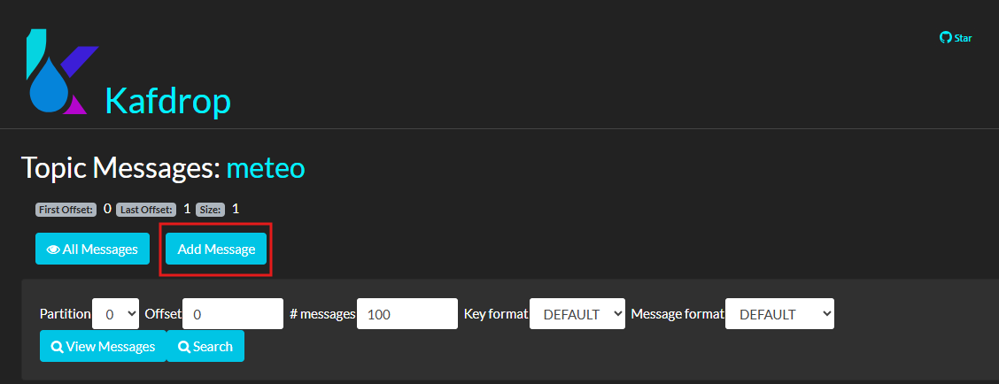
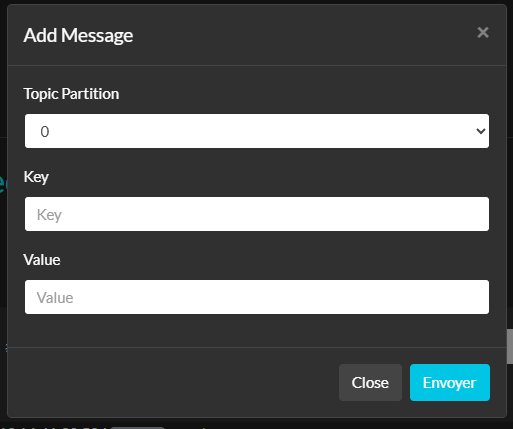
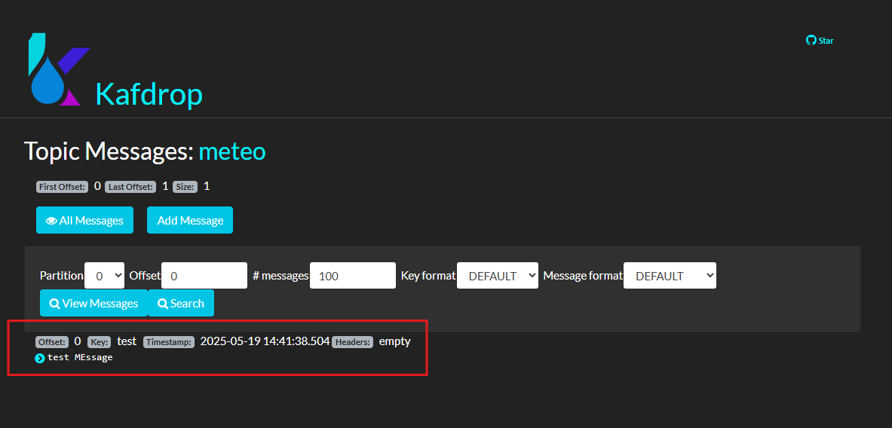
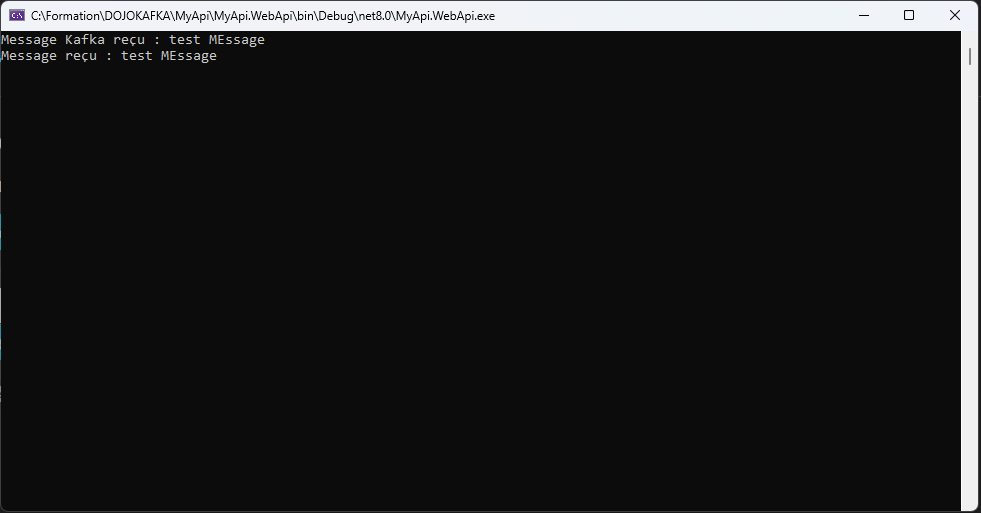

# Module 1: création du projet de test

## Qu'allons-nous faire?

Nous allons ajouter une connexion a une queue `Kafka` qui par la suite sera mocké dans les tests.

## Instructions

Démarrer avec le projet en jouant la commande suivante:

```
git clone https://github.com/CroquetMickael/KafkaDotNetIntegrationTests.git --branch feature/init
```

Une fois le projet cloné, nous allons démarrer directement `Docker` ou `Podman` en fonction de votre environnement, dans le dossier `MyApi` vous y retrouverez un `docker-compose.yml`.

Lancez le avec l'une des commandes suivante:

- Docker: `docker compose up -d`
- Podman: `podman-compose up -d`

Cela va démarrer :

- Microcks
- Kafka
- Kafdrop
- Zookeeper

Nous allons surtout nous concentrer sur les trois dernier dans un premier temps, nous reviendrons sur Microcks dans un module prochain qui vous expliquera l'intégration et son usage.

### Qu'avons nous démarrer exactement :

## Qu'est-ce qu'Apache Kafka ?

**Apache Kafka** est une plateforme de streaming distribuée conçue pour gérer des flux de données en temps réel. Initialement développée par LinkedIn et maintenant un projet open-source au sein de la fondation Apache, Kafka est largement utilisée pour la collecte, le stockage et le traitement de données en temps réel.

### Principales caractéristiques de Kafka :

1. **Architecture distribuée** :

   - Kafka fonctionne sur un ensemble de serveurs appelés **brokers** qui stockent et gèrent les données. Cela permet une scalabilité horizontale et une tolérance aux pannes.

2. **Topics** :

   - Les messages dans Kafka sont organisés en **topics**, qui sont des catégories ou des flux de données. Chaque topic peut avoir plusieurs partitions, ce qui permet de distribuer les messages sur plusieurs brokers.

3. **Producers et Consumers** :

   - Les **producers** sont des applications qui envoient des messages à des topics Kafka, tandis que les **consumers** sont des applications qui lisent ces messages. Les consommateurs peuvent s'inscrire à des groupes de consommateurs, permettant à plusieurs instances de traiter les messages de manière parallèle.

4. **Durabilité et persistance** :

   - Kafka stocke les messages de manière persistante sur disque, garantissant que les données ne sont pas perdues en cas de défaillance. Les messages peuvent être configurés pour être conservés pendant une période spécifiée ou jusqu'à ce qu'ils atteignent une certaine taille.

5. **Performance** :

   - Kafka est conçu pour traiter un grand volume de données avec une faible latence, ce qui le rend adapté aux applications nécessitant un traitement de flux en temps réel.

6. **Système de publication/abonnement** :
   - Kafka suit le modèle de publication/abonnement, permettant à plusieurs producteurs de publier des messages et à plusieurs consommateurs de s'abonner à ces messages.

### Cas d'utilisation courants :

- **Analyse en temps réel** : Traitement des données en temps réel pour des analyses instantanées.
- **Intégration de données** : Collecte et intégration de données provenant de différentes sources.
- **Streaming de données** : Transmission de données en continu à partir de capteurs, d'applications ou d'autres systèmes.
- **Microservices** : Facilitation de la communication entre des microservices en utilisant des messages pour échanger des informations.

## Kafdrop

Kafdrop est une interface web pour **Apache Kafka**, qui est un système de messagerie distribuée utilisé pour la gestion de flux de données en temps réel. Kafdrop permet aux utilisateurs de visualiser et de gérer les topics Kafka, les messages et les consommateurs de manière intuitive. Il fournit des fonctionnalités telles que :

- **Visualisation des topics** : Vous pouvez voir la liste des topics, leur structure et leur état.
- **Affichage des messages** : Kafdrop permet de consulter les messages contenus dans les topics, facilitant le débogage et l'analyse des données.
- **Gestion des consommateurs** : L'outil montre des informations sur les groupes de consommateurs et leur état, ce qui aide à surveiller la consommation des messages.

## Zookeeper

**Apache Zookeeper** est un service centralisé pour maintenir des informations de configuration, fournir des services de synchronisation et gérer des groupes de serveurs dans les systèmes distribués. Il est souvent utilisé avec des systèmes comme **Apache Kafka** pour gérer des informations critiques, telles que :

- **Coordination des services** : Zookeeper aide à coordonner les différents services d'une application distribuée, en maintenant l'état et la configuration des nœuds.
- **Gestion des clusters** : Il aide à gérer les instances dans un cluster, en s'assurant qu'elles sont synchronisées et en bonne santé.
- **Élection de leader** : Zookeeper facilite l'élection d'un nœud leader parmi plusieurs instances, ce qui est crucial pour la gestion de la charge et la tolérance aux pannes.

## Intégration de Kafka avec .Net

Créeons un dossier `Kafka` à la racine du projet `MyApi.WebApi`, une fois cela fait nous allons créer 4 fichiers nommé de cette manière:

- IMeteoConsumer.cs
- MeteoConsumer.cs
- MeteoConsumerBackgroundService.cs
- MeteoHandler.cs

### MeteoConsumer et IMeteoConsumer

Dans le fichier MeteoConsumer, nous allons gérer la consommation des messages Kafka, pour ce sujet nous aurons besoin de la librairie `Confluent.Kafka` celle-ci est déjà précisé dans le `.csproj`.

Vous aurez donc une récupération du package quand vous allez builder le projet.

```c#
using Confluent.Kafka;

namespace MyApi.WebApi.Kafka;

public class MeteoConsumer : IDisposable, IMeteoConsumer
{
    private readonly IConsumer<string, string> _kafkaConsumer;

    public MeteoConsumer(IConsumer<string, string> kafkaConsumer)
    {
        _kafkaConsumer = kafkaConsumer ?? throw new ArgumentNullException(nameof(kafkaConsumer));
    }

    public void Dispose()
    {
        _kafkaConsumer?.Close();
        _kafkaConsumer?.Dispose();
    }

    public Task<string> ConsumeAsync(CancellationToken cancellationToken)
    {
        try
        {
            var result = _kafkaConsumer.Consume(cancellationToken);
            return Task.FromResult(result.Message.Value);
        }
        catch (OperationCanceledException)
        {
            return null; // Gestion de l'annulation
        }
    }

    public void Subscribe(string topic)
    {
        _kafkaConsumer.Subscribe(topic);
    }
}
```

Et dans notre Interface `IMeteoConsumer`:

```c#
namespace MyApi.WebApi.Kafka;

public interface IMeteoConsumer
{
    void Subscribe(string topic);
    Task<string> ConsumeAsync(CancellationToken cancellationToken);
}
```

### MeteoHandler

Gérons le message reçu par Kafka dans une classe spécifique, cela permet de séparer la responsabilité entre le service qui reçoit le message et celui qui le traite.

```c#
namespace MyApi.WebApi.Kafka;

public class MeteoHandler
{
    public Task<bool> ExecuteAsync(string message)
    {
        // je reçois un message
        if (message == null)
        {
            return Task.FromResult(false);
        }
        Console.WriteLine($"Message reçu : {message}");
        return Task.FromResult(true);
    }
}
```

Dans le MeteoHandler, vous pouvez gérer le message de la manière que vous souhaitez, ici dans le cadre du dojo, nous sommes rester dans un cas classique qui renvoie juste un boolean.

### MeteoConsumerBackgroundService

Dans ce fichier nous allons utilisé notre topic Kafka que nous allons consumer avec le `Consumer` définit plus tôt ainsi que le handler.

Ce Background service va être lancé quand l'application démarre et sera en tâche de fond.

```c#
using MyApi.WebApi.Kafka;

public class MeteoConsumerBackgroundService : BackgroundService
{
    private readonly IMeteoConsumer _kafkaConsumer;
    private readonly IServiceProvider _provider;

    public MeteoConsumerBackgroundService(IMeteoConsumer kafkaConsumer, IServiceProvider provider)
    {
        _kafkaConsumer = kafkaConsumer;
        _provider = provider;
    }

    protected override async Task ExecuteAsync(CancellationToken stoppingToken)
    {
        _kafkaConsumer.Subscribe("meteo");

        try
        {
            while (!stoppingToken.IsCancellationRequested)
            {
                var consumeResult = await _kafkaConsumer.ConsumeAsync(stoppingToken);
                var handlerMeteo = _provider.GetRequiredService<MeteoHandler>();
                await handlerMeteo.ExecuteAsync(consumeResult);
            }
        }
        catch (OperationCanceledException)
        {
            // Arrêt du service
        }
    }
}
```

```
git clone https://github.com/CroquetMickael/KafkaDotNetIntegrationTests.git --branch feature/module1
```

## Modification du Program.cs

Une fois l'ensemble de ces classes et interface créée, nous avons besoin d'effectuer de l'injection de dépendance dans le `program.cs`

Ainsi que le démarrage de notre backgroundService.

```c#
// Configuration Kafka
builder.Services.AddSingleton(provider =>
{
    var config = new ConsumerConfig
    {
        BootstrapServers = "localhost:9093",
        GroupId = "1",
        AutoOffsetReset = AutoOffsetReset.Earliest
    };
    return new ConsumerBuilder<string, string>(config).Build();
});

builder.Services.AddTransient<IMeteoConsumer, MeteoConsumer>();
builder.Services.AddTransient<MeteoHandler>();
builder.Services.AddHostedService<MeteoConsumerBackgroundService>();
```

Comme vous pouvez le constater, nous créer un singleton gérant notre connexion au broker Kafka, le `localhost:9093` est récupérer principalement par le port exposé dans notre `docker-compose.yml`

Nous démarrons aussi notre background service via `builder.Services.AddHostedService<MeteoConsumerBackgroundService>();`

### Consommation d'un message

Nous allons lancer le projet .net, vous devriez avoir une fenêtre de commande qui apparait, elle restera vide, ne la coupez pas.

Connectez vous à [Kafdrop](http://localhost:9000)

Cliqué sur le broker associé que l'on a nommé `meteo` puis sur la partition `0`, vous verrez l'ensemble des messages reçu par le broker Kafka dans cette partition.

Cliquez sur `Add Message` et remplissez avec les informations suivantes:

- Topic Partition: 0
- Key: Test
- Value: Test Message





Deux choses vont ce passer, vous devriez voir votre message sur Kafdrop apparaitre et surtout si vous reprenez votre invité de commande, vous verrez notre message dedans.





Vous venez de consommer votre message Kafka, nous allons effectuer des tests sur les différentes classe implémenter.

En cas de soucis d'implémentation vous pouvez allez sur la branche git suivante qui contient la correction :

```
git clone https://github.com/CroquetMickael/KafkaDotNetIntegrationTests.git --branch feature/module1
```

[suivant >](../Module%202%20Ajout%20des%20tests%20du%20service%20externe/readme.md)
